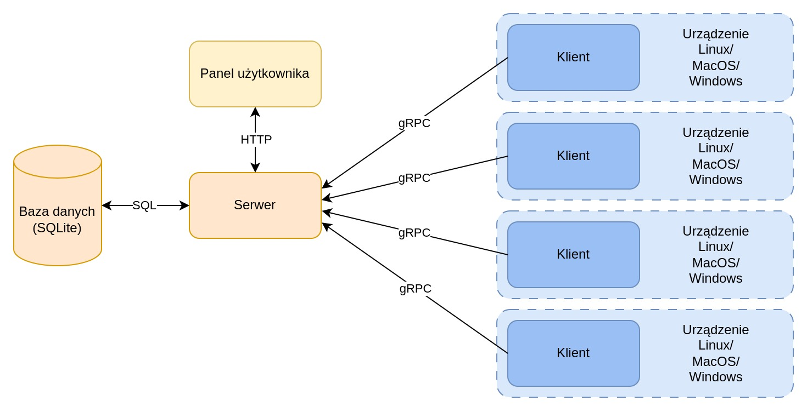
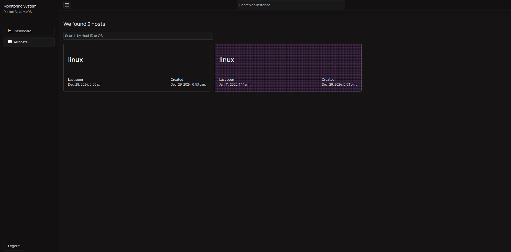
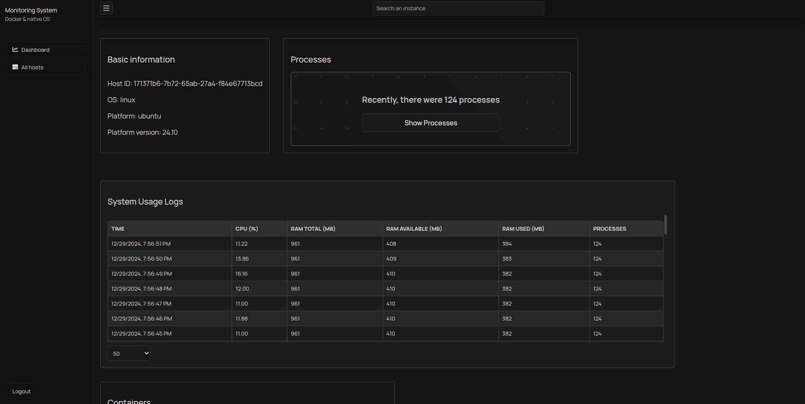
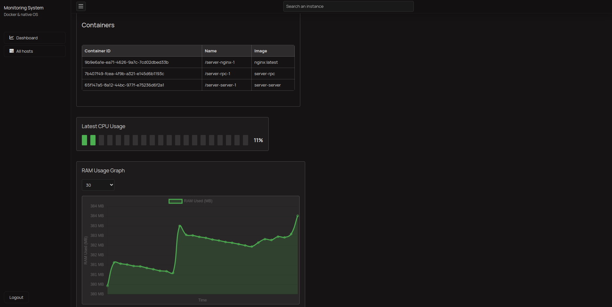
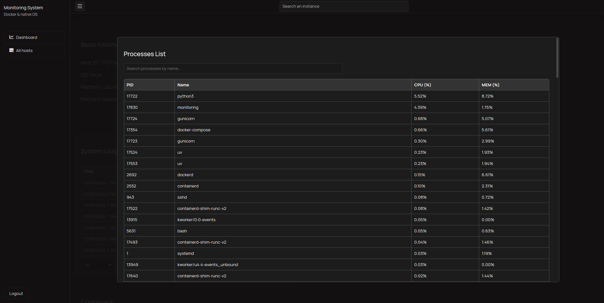

# Projekt - Programowanie systemów rozproszonych

Wykonano przez: Marcin Konwiak, Michał Konwiak

Aplikacja składa się z klienta oraz serwera. Celem serwera jest zbieranie danych zawierających informacje o systemie na którym uruchomiony jest klient. 
Użytkownik ma możliwość zalogowania się do aplikacji i przeglądania danych zebranych przez każdego klienta.

## Architektura aplikacji

Na poniższym diagramie przedstawiono architekturę aplikacji.


## Komunikacja między klientem a serwerem

Do komunikacji między klientem a serwerem wykorzystywany jest protokół **gRPC**. Struktura danych i metody komunikacji zostały zdefiniowane w plikach `.proto`.

### Przesyłane dane

1. **Czas zebrania danych**
2. **Zużycie zasobów systemowych**:
    - Zużycie CPU (w procentach)
    - Zużycie RAM:
        - Całkowita ilość
        - Dostępna ilość
        - Użyta ilość
3. **Informacje o systemie operacyjnym**:
    - ID hosta
    - Nazwa systemu
    - Platforma
    - Wersja platformy
    - Liczba procesów
4. **Informacje o procesach**:
    - PID
    - Nazwa
    - Zużycie CPU
    - Zużycie RAM
5. **Informacje o kontenerach Docker**:
    - ID
    - Nazwa
    - Obraz

## Zapis danych w bazie

Dane przesyłane przez klienta są zapisywane przez serwer w bazie danych **SQLite** za pomocą **SQL**.

### Struktura zapisywanych danych

1. **Informacje o hostach** (tabela `Host`):
    - **host_id**: Unikalny identyfikator hosta (primary key).
    - **os**: Nazwa systemu operacyjnego.
    - **created_at**: Data i czas pierwszego zgłoszenia hosta.
    - **last_seen**: Data i czas ostatniego zgłoszenia hosta.

2. **Statystyki systemowe hosta** (tabela `HostBaseStats`):
    - **id**: Unikalny identyfikator wpisu (primary key).
    - **host**: Klucz obcy do tabeli `Host`.
    - **time**: Czas zebrania danych.
    - **cpu_percent**: Zużycie CPU w procentach.
    - **ram_total**: Całkowita pamięć RAM.
    - **ram_available**: Dostępna pamięć RAM.
    - **ram_used**: Użyta pamięć RAM.
    - **os**: Nazwa systemu operacyjnego.
    - **platform**: Platforma systemu operacyjnego.
    - **platform_version**: Wersja platformy.
    - **processes**: Liczba procesów działających na hoście.

3. **Informacje o procesach** (tabela `HostProcesses`):
    - **id**: Unikalny identyfikator wpisu (primary key).
    - **pid**: Identyfikator procesu (PID).
    - **name**: Nazwa procesu.
    - **cpu**: Zużycie CPU przez proces.
    - **mem**: Zużycie pamięci przez proces.
    - **host**: Klucz obcy do tabeli `Host`.

4. **Informacje o kontenerach Docker** (tabela `HostContainers`):
    - **id**: Unikalny identyfikator wpisu (primary key).
    - **name**: Nazwa kontenera.
    - **image**: Obraz kontenera.
    - **host**: Klucz obcy do tabeli `Host`.

## Dostęp do danych

Dane zgromadzone w bazie danych są dostępne poprzez panel użytkownika w przeglądarce, który komunikuje się z serwerem za pomocą protokołu **HTTP**. Aby uzyskać dostęp do panelu użytkownika, należy podać login i hasło administratora.

### Uruchomienie klienta

Klienta można uruchomić pobierając gotowy plik wykonywalny z sekcji **Releases** w repozytorium w serwisie GitHub
lub budując aplikację z kodu źródłowego.

Do wybudowania aplikacji wymagane jest środowisko **Go** w wersji 1.23 lub nowszej.

```bash
go build main.go
```

Uruchomienie klienta:

```bash
./main start -s <adres_serwera> -i <interwał_zbierania_danych>
```

### Uruchomienie serwera

Serwer można uruchomić za pomocą narzędzia **Docker Compose** lub korzystając z lokalnego środowiska python.

Uruchomienie serwera za pomocą **Docker Compose**:

```bash
docker-compose up
```

Uruchomienie panelu użytkownika lokalnie (wymagane jest narzędzie **uv**):

```bash
uv run manage.py runserver
```

Uruchomienie serwera gRPC lokalnie:

```bash
uv run manage.py grpcrunaioserver
```

### Panel użytkownika

Lista klientów:


Szczegóły klienta:



